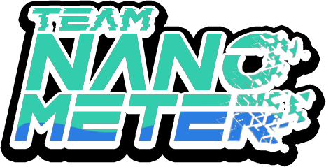
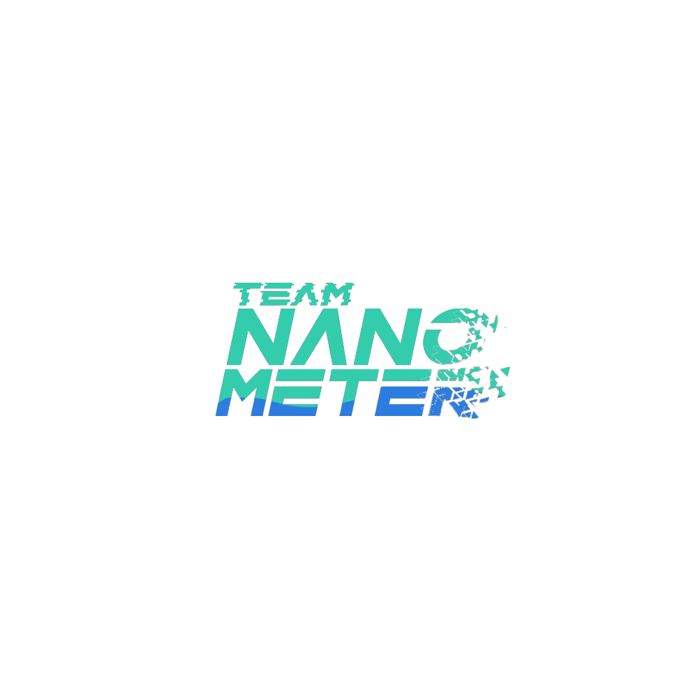
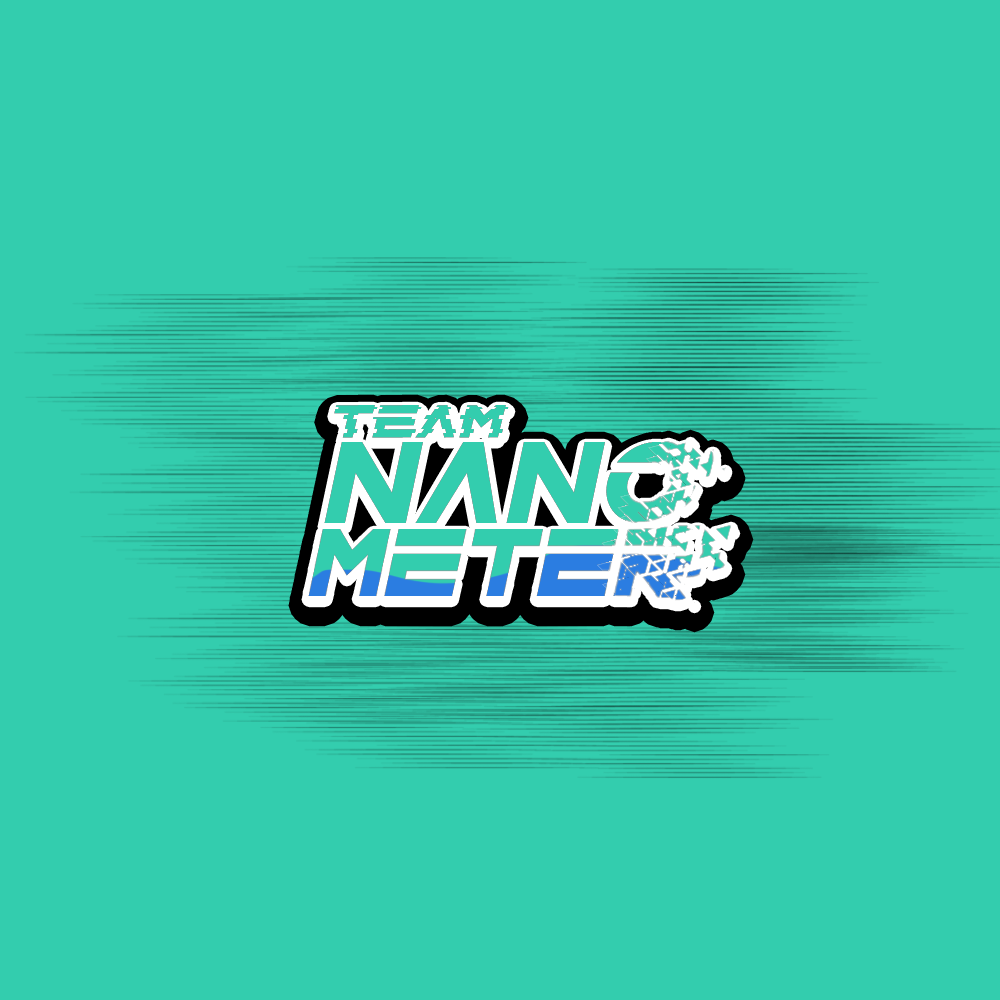
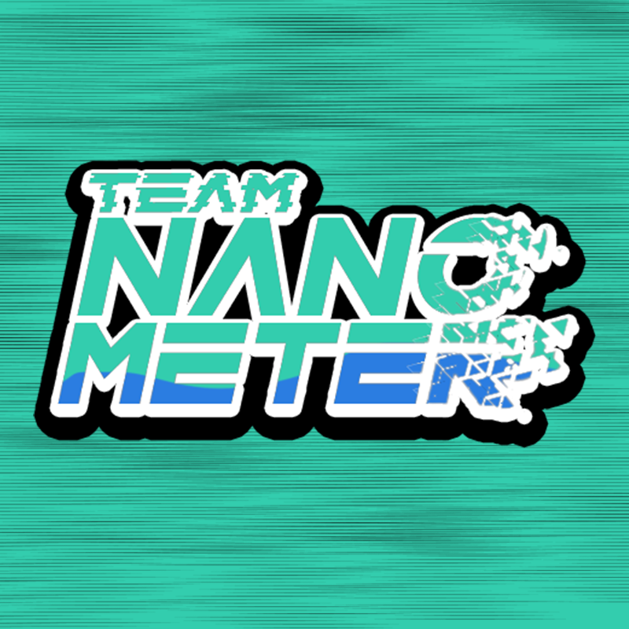
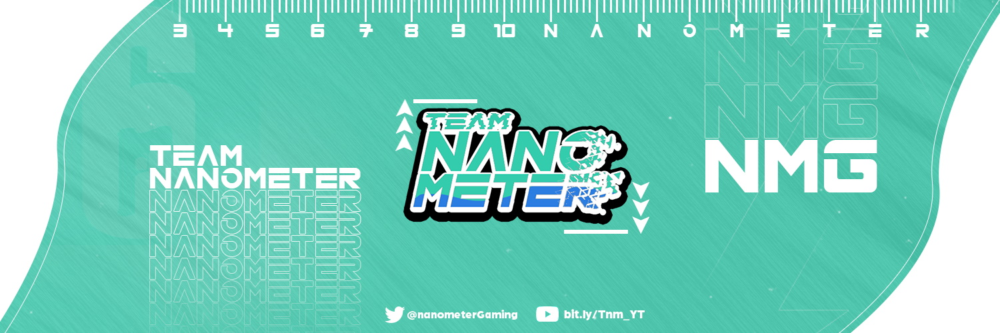
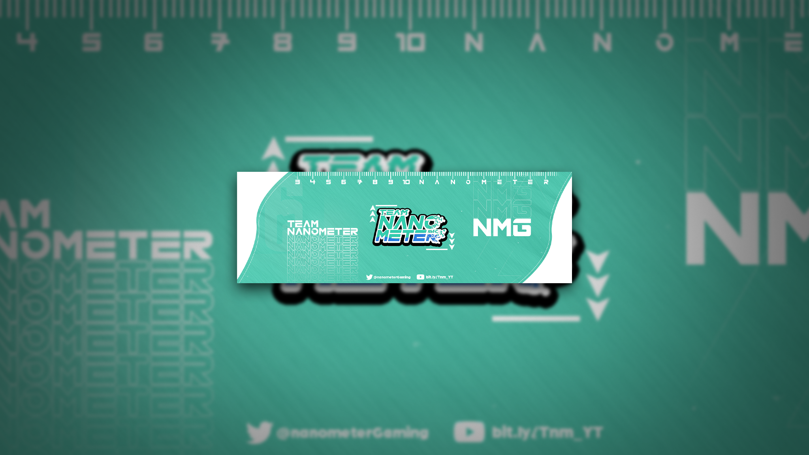

<h2 align="center">Team nanometer</h2>
<h4 align="center">Branding Guide</h4>

---

## Color
### Main Green - 

+ **HEX:** `#5BC5A7`

+ **RGB:** `91, 197, 167`

+ **HSL:** `163, 48%, 56%`

### Sub Blue - 

+ **HEX:** `#3C72DC`

+ **RGB:** `60, 114, 220`

+ **HSL:** `220, 70%, 55%`

---
## Logo

### Teamnanometer_Logo_2021_BlackOutline_Fit.png

> Size: **`466x239`**

---
### Teamnanometer_Logo_2021_NoneOutline.png

> Size: **`1000x1000`**

---
## Icon

### Teamnanometer_Logo_2021_SocialMediaIcon.png

> Size: `1000x1000`

---
### Teamnanometer_Logo_2021_SocialMediaIcon_Crop.png

> Size: `800x800`

---
## Banner

### Teamnanometer_Banner_2021.jpg

> Size: `1500x500`

---
### Tnm_YouTube.png

> Size: `2048x1152`

